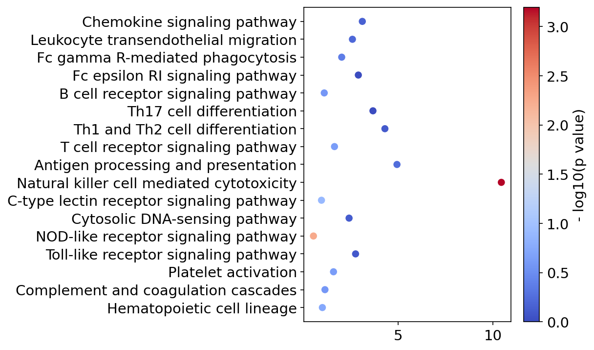

.. Licensed under the MIT License

.. _index:

=========
keggtools
=========

.. image:: https://codecov.io/gh/harryhaller001/keggtools/graph/badge.svg?token=3VBDIALBLK
 :target: https://codecov.io/gh/harryhaller001/keggtools

.. image:: https://img.shields.io/pypi/v/keggtools
   :alt: PyPI - Version

.. image:: https://img.shields.io/pypi/l/keggtools
   :alt: PyPI - License

.. image:: https://img.shields.io/pypi/pyversions/keggtools
   :alt: PyPI - Python Version

.. image:: https://zenodo.org/badge/304011676.svg
  :target: https://doi.org/10.5281/zenodo.14808443

Library for KEGG pathway enrichment analysis.

Quick Start
-----------

You can install ``keggtools`` with ``pip``::

    pip install keggtools

For more details, see :ref:`install`.

Contact
-------

If you found a bug, please use the `Issue tracker <https://github.com/harryhaller001/keggtools/issues>`_.

.. toctree::
    :caption: Start
    :maxdepth: 4
    :glob:

    install
    vignette
    kgml

.. toctree::
    :caption: API Documentation
    :maxdepth: 4
    :glob:

    autoapi/keggtools/index
